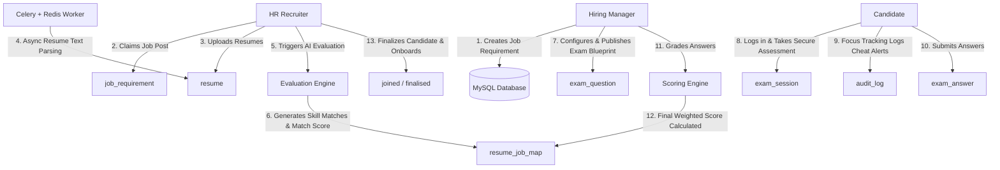

# 🛡️ AegisHire AI — Intelligent & Secure Recruitment Platform

[](https://react.dev/)
[](https://tailwindcss.com/)
[](https://www.djangoproject.com/)
[](https://www.mysql.com/)
[](https://redis.io/)
[](LICENSE)

AegisHire AI is a state-of-the-art, secure, and AI-assisted Applicant Tracking & Assessment System (ATS) designed as a comprehensive full-stack portfolio project. It is built using a decoupled architecture: a premium **React & Framer Motion** frontend dashboard and a robust **Django REST Framework** API backend.

Unlike naive keyword-matching ATS platforms, AegisHire implements deterministic multi-factor scoring, custom assessments blueprinting, active timezone expiration tracking, database row locking, and real-time anti-cheat browser logging.

---

## 🏗️ System Architecture & Workflow

AegisHire AI uses a role-based access control (RBAC) model mapping to 4 distinct user groups:
1. **Admin (Role 1)**: System oversight, registration of new users, and global job reassignments.
2. **Hiring Manager (Role 2)**: Job creation, weight configuration, candidate review, and exam grading.
3. **HR Recruiter (Role 3)**: Job claiming, candidate CV uploads, AI evaluation runs, and candidate onboarding.
4. **Candidate (Role 4)**: Assessment taking in a secure exam sandbox.



---

## 🛠️ Detailed Engineering Decisions & Flows

### 1. Job Requisition & HR Claiming Model (One-to-Many Recruiter Mapping)
* **Job Creation**: Hiring Managers design job specifications including target experience levels, candidate-specific MCQ blueprints, and custom scoring weights (`resume_weight` vs `exam_weight`, defaulting to 50/50).
* **HR Claiming Flow**: Unassigned jobs (`assigned_to = NULL`) appear in a public recruiter pool. HR Recruiters claim posts via `/api/jobs/assign/`. 
* **Multi-Job Recruiter Capacity**: There is **no restriction** on recruiter load; one HR user can claim and manage multiple job requirements concurrently (one-to-many relationship).
* **Claim Security**: If Recruiter A attempts to claim a job posting already claimed by Recruiter B, the backend rejects it with `403 Forbidden` (`Already claimed by another recruiter`). Recruiter claiming and unclaiming (releasing a job back to the pool) is fully audited in `audit_log`.

### 2. Context-Isolated Resume Upload & Routing
* **Concern**: When an HR Recruiter manages multiple jobs, candidate resumes must route exclusively to the target job and never leak into another requirement's pipeline.
* **Routing Strategy**: 
  - The HR Recruiter selects their target claimed job requirement from the dashboard dropdown, passing the `requirement_id` in the upload payload.
  - The backend validates ownership via `ownership.can_modify_requirement()`. If the recruiter does not own the target requirement, the upload is immediately rejected with `403 Forbidden`.
  - The uploaded PDF is saved to disk and a row is created in the `resume` table marked `parse_status = 'pending'`. A Celery task (`parse_and_profile_resume`) is dispatched asynchronously to parse the PDF text and map candidate skills.
  - When the recruiter triggers AI evaluation, the system queries the `resume` table for pending parsed resumes (`parse_status = 'done'`, `is_active = TRUE`) that do *not* have an entry in `resume_job_map` for the specific `requirement_id`. 
  - Once evaluated, a record is created in `resume_job_map` linking the resume to that specific `requirement_id` with its initial match score. The candidate's `resume.is_active` is marked `FALSE` so they cannot be evaluated for other jobs in parallel.

### 3. Asymmetric RAG AI Copilot (Decision Support)
* **Query Context Isolation**: Instead of dumping the entire database into the AI context (which increases token latency and causes hallucinations), our `RAGService` uses **Asymmetric RAG**.
* **Intent-Bound Context Retrieval**: 
  - When a recruiter or manager asks a question (e.g. *"Compare Marcus and Jane for the DevOps role"*), the system fetches context using the active `requirement_id`.
  - It queries the database for:
    1. **Job Details**: Position name, experience range.
    2. **Required Skills**: Skill criteria mapped to this job requirement.
    3. **Top Candidates**: Scored candidates mapped to this requirement, including their scores, matched skills, missing skills, and AI summaries.
    4. **Pipeline Summary**: Metrics on candidates in each stage (`applied`, `shortlisted`, `exam_submitted`, etc.).
  - This highly parsed, structured context is passed to the Google Gemini API, ensuring the response is **completely grounded, accurate, and context-isolated**.

### 4. Anti-Cheat Candidate Exam Center
* **Exam Eligibility**: Candidates (Role 4) log in using accounts generated during the shortlisting process. The backend enforces that the candidate matches the `user_account_id` mapped in `resume_job_map`.
* **Configurable Duration**: The exam duration is fetched dynamically from the job requirement setting (`exam_duration_minutes`, defaulting to 60).
* **Database Row Locking (`SELECT FOR UPDATE`)**: 
  - To prevent double-submit network race conditions (such as double-clicking "Submit" or resubmitting answers after the session expired), the backend wraps the answers submission endpoint in a `transaction.atomic()` block.
  - The SQL query utilizes `SELECT ... FOR UPDATE` to lock the candidate's `exam_session` row, blocking subsequent submission threads until the first transaction completes.
* **Timezone-Aware Expiration Validation**: The session's `expires_at` is compared against the server's current timestamp. The comparison engine automatically checks if database datetimes are timezone-aware and aligns them UTC-to-UTC to prevent timezone offset bypassing.
* **Focus Session Auditing**: The React frontend monitors browser window blur, copy-paste events, and tab changes. Any violations stream immediately to the `/api/audit-log/` backend, printing warnings in the admin audit history.
* **Manager Evaluation & Grading**: Candidate submissions (MCQ choices and open-ended text answers) are stored in `exam_answer`. The Hiring Manager (Role 2) reviews candidate answers in their overview dashboard and assigns scores.
* **Weighted Score Recommendation Engine**:
  Once the manager submits grades via `manager_update_exam_scores`, the pipeline status transitions to `exam_scored` and the final recommendation score is calculated:
  
  $$\text{Final Score} = \frac{(\text{Resume Score} \times \text{Resume Weight}) + (\text{Exam Score} \times \text{Exam Weight})}{100}$$
  
  The platform maps this combined score to dynamic decision categories:
  * **Score $\ge$ 80%**: `Strong Hire` (High Confidence)
  * **Score $\ge$ 70%**: `Hire` (High Confidence)
  * **Score $\ge$ 60%**: `Hold` (High Confidence)
  * **Score $<$ 60%**: `Reject` (High Confidence)

  These scores and candidate profiles are immediately displayed in the HR onboarding view, enabling recruiters to finalize (`finalised`) candidates for onboarding.

---

---

## 🚀 Setup & Installation

### Prerequisites
* Python 3.9+
* Node.js 18+
* MySQL Server
* Redis Server (For Celery background workers)

### 1. Backend Setup
1. Navigate to the backend directory:
   ```bash
   cd backend
   ```
2. Create and activate a virtual environment:
   ```bash
   python -m venv venv
   # Windows:
   .\venv\Scripts\activate
   # macOS/Linux:
   source venv/bin/activate
   ```
3. Install dependencies:
   ```bash
   pip install -r requirements.txt
   ```
4. Configure environment variables in `.env` (use `.env.example` as a template):
   ```ini
   DB_TYPE=local
   LOCAL_DB_NAME=recruitment
   LOCAL_DB_USER=root
   LOCAL_DB_PASSWORD=your_password
   GEMINI_API_KEY=your_gemini_api_key
   ```
5. Apply database schema migrations:
   ```bash
   python manage.py migrate
   ```
6. **Seed Default Portfolio Users**:
   Populate test users, positions, skills, and sample job states using the custom seeder command:
   ```bash
   python manage.py seed_portfolio_data
   ```
7. Run the development server:
   ```bash
   python manage.py runserver
   ```

### 2. Celery Worker (Asynchronous Tasks)
Start the Celery worker (use `-P solo` on Windows to avoid process synchronization conflicts):
```bash
python -m celery -A recruitment worker --loglevel=info -P solo
```

### 3. Frontend Setup
1. Navigate to the frontend directory:
   ```bash
   cd ../frontend
   ```
2. Install dependencies:
   ```bash
   npm install
   ```
3. Run the Vite developer server:
   ```bash
   npm run dev
   ```
4. Access the application in your browser at `http://localhost:5173`.

---

## 🧪 Seeded Test Accounts (Portfolio Demo)

The `seed_portfolio_data` command seeds the following accounts to easily demo role-based workflows (all accounts use password **`password123`**):

| Role | Username | Email | Department / Purpose |
|---|---|---|---|
| **Admin** | `admin` | `admin@aegishire.ai` | Global user creation, job reassignments |
| **Manager** | `manager_lisa` | `lisa.vance@aegishire.ai` | Engineering Manager (owns Software Engineer post) |
| **Manager** | `manager_john` | `john.doe@aegishire.ai` | Product Manager (owns Product Manager post) |
| **HR Recruiter** | `hr_sarah` | `hr_sarah@aegishire.ai` | Recruiting specialist (has claimed Lisa's Software Engineer post) |
| **HR Recruiter** | `hr_michael` | `hr_michael@aegishire.ai` | Recruiting specialist (has claimed John's Product Manager post) |
| **Candidate** | `candidate_marcus` | `candidate_marcus@aegishire.ai` | Test candidate user |
| **Candidate** | `candidate_jane` | `candidate_jane@aegishire.ai` | Test candidate user |
