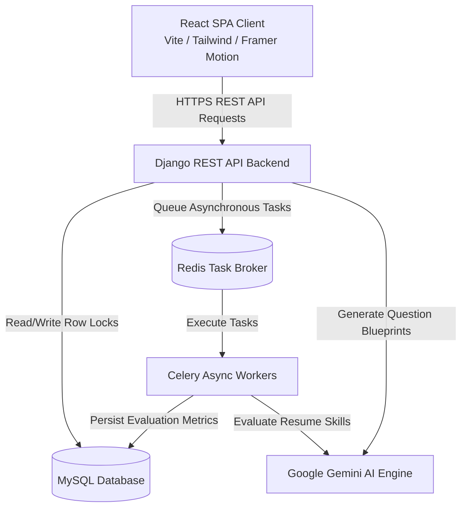

# 🛡️ AegisHire AI — Intelligent & Secure Recruitment Platform

[](https://react.dev/)
[](https://tailwindcss.com/)
[](https://www.djangoproject.com/)
[](https://www.mysql.com/)
[](https://redis.io/)
[](LICENSE)

AegisHire AI is a state-of-the-art, secure, and AI-assisted Applicant Tracking & Assessment System (ATS). It is built with a decoupled modern architecture combining a premium, highly interactive **React & Framer Motion** frontend dashboard with a hardened **Django REST Framework** API backend.

Unlike traditional keyword-matching ATS platforms, AegisHire integrates deterministic, multi-factor candidate scoring with secure assessment blueprinting and real-time candidate session anti-cheat log streams.

---

## 📐 System Architecture

The application is split into a client-server architecture with background worker tasks to process high-latency workloads asynchronously:



---

## 🚀 Key Architectural Features

### 1. 🤖 Evaluation & Assessment Engines
* **Deterministic Multi-Factor Scoring:** Evaluates candidates using a reproducible, weighted **50/30/20 system** (50% Skills mapping, 30% Experience years, 20% Education tier), completely eliminating black-box AI bias.
* **AI Assessments Blueprinter:** Leveraging Google Gemini AI, the system automatically parses candidate-specific skill gaps and designs customized MCQ/technical question pool blueprints for evaluation.
* **Governance Lifecycle:** Questions undergo a complete `Draft ➔ Approved ➔ Published` workflow. Publishing an exam captures an immutable snapshot of all questions to secure testing integrity.

### 2. 🔒 Hardened Assessment Security
* **Cheat-Resistant Monitoring:** Logs tab blurs, copy-paste events, and browser focus changes during live assessments.
* **Row Locking (`SELECT FOR UPDATE`):** Enforces atomic database locks on answer submissions to prevent double-click API race conditions.
* **Aware Timezone Validations:** Ensures robust, timezone-aware comparisons for strict exam duration expirations.
* **Role-Based Access Control (RBAC):** Restricts data queries based on user roles (`Admin`, `Recruiter/HR`, `Manager`, `Candidate`).

### 3. 🎨 Premium Interaction Design
* **Living Hero Workspace:** A responsive, interactive dashboard simulating resume analysis (File ingest ➔ Scan beam sweep ➔ Skills pop ➔ Match score count-up ➔ AI Hire badge reveal) with 3D-tilt mouse perspective hover.
* **S-Curve Centered Timeline:** A scroll-progress-linked center timeline utilizing a custom double-bend SVG track and a glowing animated bead showing the recruitment pipeline steps.
* **Interactive Bento Grid:** Spotlights natural language semantic search filtering, real-time question generation rendering, and secure log streams.

---

## 🛠️ Technology Stack

| Component | Technology | Usage |
|:---|:---|:---|
| **Frontend** | React 18, Vite, Tailwind CSS, Framer Motion, Lucide | Single Page Application, high-fidelity micro-interactions, responsive design |
| **Backend** | Python 3, Django 5.x, Django REST Framework | JSON API development, database routing, security filters |
| **Database** | MySQL | Role-based data storage, row locking support |
| **Task Queue** | Celery, Redis | Asynchronous resume parsing, evaluation workflows, stale session cleanups |
| **AI Integration** | Google Gemini API (via AI Service Factory) | Skill gap analysis, question pool generation, interviewer preparation guides |

---

## 📂 Repository Structure

```text
aegishire-ai-recruitment-tool/
├── backend/                       # Django REST API Backend
│   ├── backend/                   # Django settings, routers, and WSGI/ASGI configurations
│   ├── recruitment/               # Core business logic app (Models, Views, Serializers)
│   │   ├── services/              # Decoupled services (AI, Parser, Search, Scoring, Auditing)
│   │   ├── repositories/          # Repo layer isolating raw SQL/ORM query sets
│   │   └── tests/                 # Security, RBAC, and business logic unit tests
│   ├── requirements.txt           # Backend python packages
│   └── manage.py                  # Django administrative script
│
├── frontend/                      # React SPA Frontend (Vite)
│   ├── src/
│   │   ├── components/            # Reusable UI library (layout, shared, dialogs, charts)
│   │   ├── context/               # AuthContext state managers
│   │   ├── hooks/                 # Custom hooks (keyboard shortcuts, API callers)
│   │   ├── lib/                   # Feature flags, axios clients, styles helpers
│   │   ├── pages/                 # Routing pages (Landing, Login, HR/Manager Dashboards, Exams)
│   │   └── App.jsx                # Layout wrapper & routing tables
│   ├── tailwind.config.js         # Design token customizations
│   └── package.json               # Node packages list
```

---

## 🔧 Environment Variables Reference

Create a `.env` file in the `backend/` directory with the following structure:

| Key | Example Value | Description |
|:---|:---|:---|
| `DB_TYPE` | `local` | Database target environment (e.g., `local`, `production`) |
| `LOCAL_DB_NAME` | `recruitment` | Name of the MySQL Schema |
| `LOCAL_DB_USER` | `root` | MySQL user name |
| `LOCAL_DB_PASSWORD` | `your_password` | Password for your MySQL user |
| `GEMINI_API_KEY` | `AIzaSy...` | Your API key to connect to Google Gemini |
| `REDIS_URL` | `redis://127.0.0.1:6379/0` | Connection string for Redis Broker |

---

## 🚀 Setup & Installation

### Prerequisites
* Python 3.9+
* Node.js 18+
* MySQL Server
* Redis Server (For Celery background workers)

### 1. Backend Setup
1. Navigate to the backend directory:
   ```bash
   cd backend
   ```
2. Create and activate a virtual environment:
   ```bash
   python -m venv venv
   # Windows:
   .\venv\Scripts\activate
   # macOS/Linux:
   source venv/bin/activate
   ```
3. Install dependencies:
   ```bash
   pip install -r requirements.txt
   ```
4. Configure environment variables in `.env` (use `.env.example` as a template).
5. Apply database schema migrations:
   ```bash
   python manage.py migrate
   ```
6. Run the local development server:
   ```bash
   python manage.py runserver
   ```

### 2. Celery Worker (Asynchronous Tasks)
Start the Celery worker (use `-P solo` on Windows to avoid process synchronization conflicts):
```bash
python -m celery -A recruitment worker --loglevel=info -P solo
```

### 3. Frontend Setup
1. Navigate to the frontend directory:
   ```bash
   cd ../frontend
   ```
2. Install dependencies:
   ```bash
   npm install
   ```
3. Run the Vite developer server:
   ```bash
   npm run dev
   ```
4. Access the application in your browser at `http://localhost:5173`.

---

## 🔒 Security Auditing & Regression Tests

The backend features a comprehensive security test suite verifying RBAC restrictions, candidate session constraints, and database log integrity. Run it using:
```bash
python manage.py test recruitment.tests
```

---

## 📄 License
This project is licensed under the MIT License. See the [LICENSE](LICENSE) file for details.
